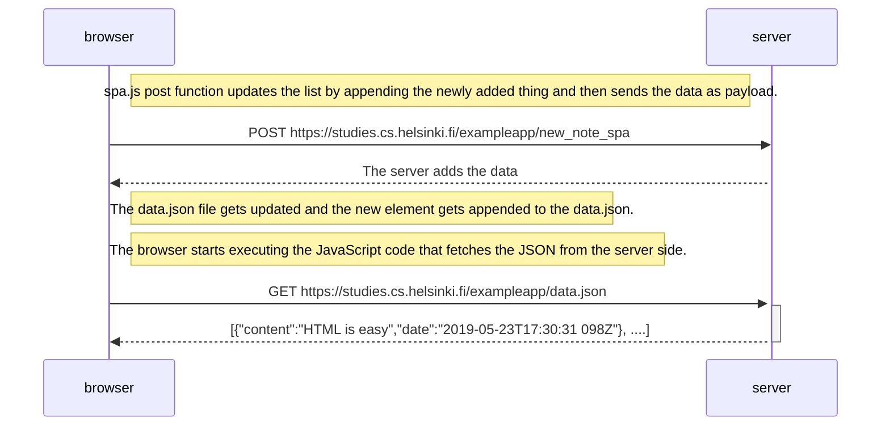

# Question 0.6 ( Part 0 )

```mermaid
sequenceDiagram
    participant browser
    participant server

    Note right of browser: spa.js post function updates the list by appending the newly added thing and then sends the data as payload.

    browser->>server: POST https://studies.cs.helsinki.fi/exampleapp/new_note_spa
    activate server

    server-->>browser: The server adds the data 

    Note right of browser: The data.json file gets updated and the new element gets appended to the data.json.

    Note right of browser: The browser starts executing the JavaScript code that fetches the JSON from the server side. 

    browser->>server: GET https://studies.cs.helsinki.fi/exampleapp/data.json
    activate server
    server-->>browser: [{"content":"HTML is easy","date":"2019-05-23T17:30:31 098Z"}, ....]
    deactivate server

```